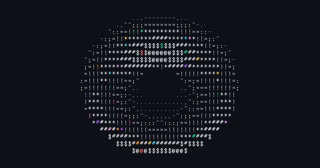

### Software Engineering Student | Frontend Developer | Problem Solver

<!-- Portfolio site currently down - commenting out until restored

-->

## 🎓 About Me

Computer Science major with Software Engineering concentration at the University of Indianapolis, specializing in frontend development and modern web technologies. Currently developing AI-powered educational tools and building developer automation systems.

- 🔭 Currently developing: **KSPT Curricular Command Center** (AI-powered curriculum mapping tool)
- 🌱 Currently building: **n8n Workflow Transpiler** (Convert automation workflows to standalone code)
- 💼 Experience: Frontend Developer, Database Configuration, CI/CD Implementation, Machine Learning
- 🎯 Interests: Full-stack development, workflow automation, compiler design, data science, game development

 

## ⚡ Quick Stats

  
  
  
  
  

## 🛠️ Tech Stack

### 💻 Languages

### 🚀 Frameworks & Libraries

### 🗄️ Databases & Cloud

### 🛠️ DevOps & Tools

### 🤖 AI & Data Science

## 🚀 Featured Projects

<!-- KSPT repo is private - commenting out until public
### [KSPT Curricular Command Center](https://github.com/RBASOE-Class-Projects/202510_ENGR496_KSPT)
**AI-Powered Curriculum Mapping Tool** | *Capstone Project (ENGR 496) - In Development*
- 🎨 Frontend lead using **Svelte** for responsive component architecture
- 🤖 Integrated **Gemini AI** for automated course objective mapping to accreditation standards
- 🔧 Built modular components: Header, Tabs, Footer, Pagination, Overview
- 🐳 Configured **Docker** for database automation and workflow orchestration
- ☁️ **Firebase** backend integration for real-time data management
- 👥 Collaborative capstone project for Krannert School of Physical Therapy

**Tech:** Svelte · Firebase · Gemini AI · Docker · n8n

-->

### [n8n-to-Python Transpiler](https://github.com/c4snipes/n8n-transpiler)
**Workflow Automation Converter** | *Developer Tooling*
- 🔄 Converts n8n visual workflows into standalone Python scripts
- 🌳 AST-based code generation for clean, maintainable output
- 📦 Supports common n8n nodes: HTTP requests, data transformation, conditionals
- 🎯 CLI tool for automation developers and DevOps engineers
- 🔧 Eliminates n8n runtime dependency for production deployments

**Tech:** Python · Abstract Syntax Tree · n8n API · CLI

### [ColeSnipesPortfolio](https://github.com/c4snipes/ColeSnipesPortfolio)
**Personal Portfolio Website**
- 📱 Clean, mobile-friendly design showcasing projects and resume
- ⚡ Fast, modern web development with optimized performance
- 🎯 Interactive project demonstrations and contact integration

**Tech:** JavaScript · HTML · CSS

### [Budget Manager](https://github.com/c4snipes/budget_manager)
**Personal Finance Tracking Application**
- 💰 Track expenses and manage budgets with intuitive interface
- 🦀 Built with **Rust** for performance and reliability
- 📊 Data visualization for financial insights

**Tech:** Rust

### [Stackoverflow Minigame](https://github.com/c4snipes/stackoverflow-minigame)
**Interactive Stack-Based Puzzle Game**
- 🎮 Climb higher without overflowing in this C# game
- 🏗️ Clean architecture demonstrating game development principles
- 🎯 Stack frame mechanics with progressive difficulty

**Tech:** C#

### [Bluetooth Attendance Application](https://github.com/c4snipes/BluetoothAttendanceApplication)
**Automated Attendance Tracking System**
- 📍 Bluetooth-based proximity detection for attendance logging
- 🐍 **Python** backend for device management and data processing
- 📊 Automated reporting and analytics

**Tech:** Python

## 📊 Contributions

### Academic & Open Source Projects

<!-- KSPT repo is private - commenting out until public
**[KSPT Capstone Project](https://github.com/RBASOE-Class-Projects/202510_ENGR496_KSPT)** - RBASOE Class Projects
- Lead frontend developer for curriculum mapping tool
- Team infrastructure setup and database configuration
- Extensive Svelte component development and Firebase integration
-->

<!-- WebVPython repo unavailable - commenting out
**[WebVPython-Refactoring](https://github.com/UINDY-SWEN-200/WebVPython-Refactoring-202310)** - Software Engineering Project
- Contributed to Monaco Editor integration and URL loading features
- Implemented Google Drive storage integration
- Refactored Flask and IDE.js routing architecture
-->

**[wmWVPRunner](https://github.com/UINDY-SWEN-200/wmWVPRunner)** - VPython Runner Tool
- Development contributions for VPython execution environment

**[flaskGlowscriptHost](https://github.com/UINDY-SWEN-200/flaskGlowscriptHost/tree/screenShotExecutable)** - Screenshot Executable Branch
- Implemented screenshot capture functionality

## 📈 GitHub Stats

## 🏆 GitHub Trophies

## 📊 Contribution Graph

## 🐍 Contribution Snake

## 🎯 Current Focus

- 🔨 Building **n8n Workflow Transpiler** - Converting automation workflows to standalone Python scripts
- 🌐 Full-stack development with modern frameworks (Svelte, Firebase, Flask)
- 🤖 Exploring AI/ML integration in applications
- 🎮 Game development and community tools side projects

## 📫 Let's Connect!

I'm always interested in collaborating on interesting projects or discussing tech! Feel free to reach out:

- 💼 [LinkedIn](https://www.linkedin.com/in/cole-snipes/)
- 📧 [cole.snipes@icloud.com](mailto:cole.snipes@icloud.com)
<!-- Portfolio site currently down - commenting out until restored
- 🌐 [Portfolio Website](https://colesnipesportfolio.netlify.app/)
-->
- 📍 Indianapolis, IN

## 🎮 Play 2048

**Can you reach 2048?** 🏆

### 💡 "Talk is cheap. Show me the code." – Linus Torvalds

