### Software Engineering Student | Frontend Developer | Problem Solver

<!-- Portfolio site currently down - commenting out until restored

-->

📑 <b>Table of Contents</b>

| Section | Description |
|:--------|:------------|
| [🎓 About Me](#-about-me) | Background and current work |
| [⚡ Quick Stats](#-quick-stats) | At-a-glance info |
| [🛠️ Tech Stack](#%EF%B8%8F-tech-stack) | Languages, frameworks, tools |
| [🗺️ Learning Roadmap](#%EF%B8%8F-learning-roadmap) | Tech progression path |
| [🚀 Featured Projects](#-featured-projects) | Portfolio highlights |
| [📊 Contributions](#-contributions) | Open source work |
| [📈 GitHub Stats](#-github-stats) | Activity metrics |
| [🏆 GitHub Trophies](#-github-trophies) | Achievements |
| [🖥️ Hardware Setup](#%EF%B8%8F-hardware-setup) | Dev environment |
| [🪣 Bucket List](#-bucket-list---things-i-want-to-build) | Future projects |
| [🎮 Gaming & Hobbies](#-gaming--hobbies) | Personal interests |
| [📫 Let's Connect](#-lets-connect) | Contact info |

## 🎓 About Me

Computer Science major with Software Engineering concentration at the University of Indianapolis, specializing in frontend development and modern web technologies. Currently developing AI-powered educational tools and building developer automation systems.

- 🔭 Currently developing: **KSPT Curricular Command Center** (AI-powered curriculum mapping tool)
- 🌱 Currently building: **n8n Workflow Transpiler** (Convert automation workflows to standalone code)
- 💼 Experience: Frontend Developer, Database Configuration, CI/CD Implementation, Machine Learning
- 🎯 Interests: Full-stack development, workflow automation, compiler design, data science, game development

 

### 🎵 Currently Listening To

## ⚡ Quick Stats

  
  
  
  
  

## 🛠️ Tech Stack

### 💻 Languages

### 🚀 Frameworks & Libraries

### 🗄️ Databases & Cloud

### 🛠️ DevOps & Tools

### 🤖 AI & Data Science

## 🗺️ Learning Roadmap

```mermaid
graph LR
    subgraph MASTERED[" ✅ Mastered "]
        A[JavaScript]
        B[Python]
        C[HTML/CSS]
        D[React]
    end

    subgraph LEARNING[" 📚 Currently Learning "]
        E[TypeScript]
        F[Rust]
        G[AI/ML]
        H[Svelte]
    end

    subgraph NEXT[" 🎯 Next Up "]
        I[Go]
        J[Kubernetes]
        K[System Design]
    end

    subgraph FUTURE[" 🔮 Future Goals "]
        L[WebAssembly]
        M[Blockchain]
        N[Compilers]
    end

    A --> E
    B --> G
    D --> H
    E --> I
    F --> L
    G --> K
    H --> J
    I --> N
    J --> M

    style MASTERED fill:#238636,stroke:#238636,color:#fff
    style LEARNING fill:#1f6feb,stroke:#1f6feb,color:#fff
    style NEXT fill:#8957e5,stroke:#8957e5,color:#fff
    style FUTURE fill:#f85149,stroke:#f85149,color:#fff
```

## 🚀 Featured Projects

<!-- KSPT repo is private - commenting out until public
### [KSPT Curricular Command Center](https://github.com/RBASOE-Class-Projects/202510_ENGR496_KSPT)
**AI-Powered Curriculum Mapping Tool** | *Capstone Project (ENGR 496) - In Development*
- 🎨 Frontend lead using **Svelte** for responsive component architecture
- 🤖 Integrated **Gemini AI** for automated course objective mapping to accreditation standards
- 🔧 Built modular components: Header, Tabs, Footer, Pagination, Overview
- 🐳 Configured **Docker** for database automation and workflow orchestration
- ☁️ **Firebase** backend integration for real-time data management
- 👥 Collaborative capstone project for Krannert School of Physical Therapy

**Tech:** Svelte · Firebase · Gemini AI · Docker · n8n

-->

### [n8n-to-Python Transpiler](https://github.com/c4snipes/n8n-transpiler)
**Workflow Automation Converter** | *Developer Tooling*
- 🔄 Converts n8n visual workflows into standalone Python scripts
- 🌳 AST-based code generation for clean, maintainable output
- 📦 Supports common n8n nodes: HTTP requests, data transformation, conditionals
- 🎯 CLI tool for automation developers and DevOps engineers
- 🔧 Eliminates n8n runtime dependency for production deployments

**Tech:** Python · Abstract Syntax Tree · n8n API · CLI

### [ColeSnipesPortfolio](https://github.com/c4snipes/ColeSnipesPortfolio)
**Personal Portfolio Website**
- 📱 Clean, mobile-friendly design showcasing projects and resume
- ⚡ Fast, modern web development with optimized performance
- 🎯 Interactive project demonstrations and contact integration

**Tech:** JavaScript · HTML · CSS

### [Budget Manager](https://github.com/c4snipes/budget_manager)
**Personal Finance Tracking Application**
- 💰 Track expenses and manage budgets with intuitive interface
- 🦀 Built with **Rust** for performance and reliability
- 📊 Data visualization for financial insights

**Tech:** Rust

### [Stackoverflow Minigame](https://github.com/c4snipes/stackoverflow-minigame)
**Interactive Stack-Based Puzzle Game**
- 🎮 Climb higher without overflowing in this C# game
- 🏗️ Clean architecture demonstrating game development principles
- 🎯 Stack frame mechanics with progressive difficulty

**Tech:** C#

### [Bluetooth Attendance Application](https://github.com/c4snipes/BluetoothAttendanceApplication)
**Automated Attendance Tracking System**
- 📍 Bluetooth-based proximity detection for attendance logging
- 🐍 **Python** backend for device management and data processing
- 📊 Automated reporting and analytics

**Tech:** Python

## 📊 Contributions

### Academic & Open Source Projects

<!-- KSPT repo is private - commenting out until public
**[KSPT Capstone Project](https://github.com/RBASOE-Class-Projects/202510_ENGR496_KSPT)** - RBASOE Class Projects
- Lead frontend developer for curriculum mapping tool
- Team infrastructure setup and database configuration
- Extensive Svelte component development and Firebase integration
-->

<!-- WebVPython repo unavailable - commenting out
**[WebVPython-Refactoring](https://github.com/UINDY-SWEN-200/WebVPython-Refactoring-202310)** - Software Engineering Project
- Contributed to Monaco Editor integration and URL loading features
- Implemented Google Drive storage integration
- Refactored Flask and IDE.js routing architecture
-->

**[wmWVPRunner](https://github.com/UINDY-SWEN-200/wmWVPRunner)** - VPython Runner Tool
- Development contributions for VPython execution environment

**[flaskGlowscriptHost](https://github.com/UINDY-SWEN-200/flaskGlowscriptHost/tree/screenShotExecutable)** - Screenshot Executable Branch
- Implemented screenshot capture functionality

## 📈 GitHub Stats

## 🏆 GitHub Trophies

## 📊 Contribution Graph

## 🖥️ Hardware Setup

| Component | Specification |
|:---------:|:-------------|
| 💻 **Machine** | MacBook Pro (Apple M1 Pro) |
| 🧠 **Memory** | 16 GB Unified Memory |
| 💾 **Storage** | SSD |

🔧 <b>Software & Development Environment</b>

 

| Category | Tools |
|:--------:|:------|
| **Primary IDE** | VS Code |
| **AI Assistants** | Claude Code, GitHub Copilot |
| **Terminal** | Zsh, TMUX |
| **Package Managers** | Homebrew, npm, pip, Anaconda |
| **Containers** | Docker |
| **Cloud/Deploy** | Fly.io, Vercel, Firebase |
| **Version Control** | Git, GitHub |
| **Languages** | Python 3.13, Node.js, .NET, Haskell |
| **Embedded** | ESP-IDF (IoT Development) |

## 🪣 Bucket List - Things I Want to Build

| Status | Project | Description |
|:------:|:--------|:------------|
| 📋 | **Game** | Develop a 2D/3D game using Unity or UE5 |
| 📋 | **Mobile App** | College sports dynasty/management sim |
| 📋 | **Graph Builder** | No-code tool to create graphs from data, APIs, or files |

**Legend:** 🔨 In Progress | 📋 Planned | ✅ Completed

## 🎮 Gaming & Hobbies

---

### 🕹️ Play 2048

**Can you reach 2048?** 🏆

---

### 🎌 Anime Stats

## 📫 Let's Connect

I'm always interested in collaborating on interesting projects or discussing tech! Feel free to reach out:

- 💼 [LinkedIn](https://www.linkedin.com/in/cole-snipes/)
- 📧 [cole.snipes@icloud.com](mailto:cole.snipes@icloud.com)
- 📍 Indianapolis, IN

## 📊 Profile Meta

### 🎨 Daily Themes
*Theme rotates automatically each day!*

| Mon | Tue | Wed | Thu | Fri | Sat | Sun |
|:---:|:---:|:---:|:---:|:---:|:---:|:---:|
|  |  |  |  |  |  |  |

**Today's Theme:**
<!-- DAILY_THEME -->
**Synthwave**

<!-- /DAILY_THEME -->

---

📅 **This Day in History:**
<!-- THIS_DAY_IN_HISTORY -->
**2016**: An earthquake of magnitude 6.6 strikes southern Taiwan, killing 117 people.
<!-- /THIS_DAY_IN_HISTORY -->

---

📝 **README Stats:**
<!-- README_STATS -->

<!-- /README_STATS -->

🕐 **Last Updated:** <!-- LAST_UPDATED -->February 06, 2026 at 02:42 UTC<!-- /LAST_UPDATED -->

### 💡 "Talk is cheap. Show me the code." – Linus Torvalds

